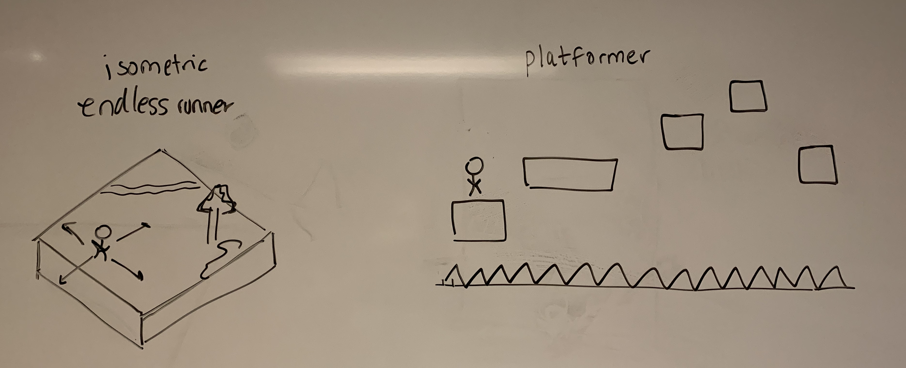

# Performance Device

> Module 2, Task 2

## Task details

**Objective:**

Create a performance device. Performable is broadly interpreted and may include devices such as digital instruments, or game consoles.

**Constraints:**

- Demonstrate three modes of operation
  - A mode is a system state that alters how an input action effects the output
- Utilize the hardware given out in class
  - Momentary button
  - Joystick
  - SPST switch

## Ideation

I wanted to create a video game console. As a single person team, I wanted to create a game that would be of moderate complexity to create and that would run smoothly on the Pi.

With the limited controls available, I thought about which game formats would work the best. I shortlisted two concepts:

1. An endless runner (like Jetpack Joyride)
2. A platforming game (like Mario)

Both ideas are not novel, but would let me explore the game engine (below) and are well suited to traditional hardware controls like joysticks. Any meaningful addition of complexity (for e.g. isometric terrain) would be too difficult to code up in Processing, so I had to think of alternate implementations.

In the end I opted for the platformer because it was easier to implement, given the time and resource constraints.

## Implementation

### Choice of engine

I considered a number of options:

- Processing: no physics or other nice features. Have to code all logic yourself
- Godot: popular engine but runs slowly on Raspberry Pi
- LOVE: runs well on the Pi and similar to Processing, but uses Lua, with which I'm unfamiliar

In the end I elected to use Godot, using an older renderer which has compatibility with most hardware.

I was really impressed by how many features Godot has out of the box, including:

- Physics, movement, collision
- Sprite animations
- Camera movements
- Animated parallax backgrounds

Creating even a simple platformer would have been a pain in Processing but was relatively simple in Godot.

I relied heavily on Godot's documentation and a Udemy course I've been meaning to complete since sophomore year.

### Communication between ESP32 and the game

Godot has little support for WebSockets and Serial data input. I tried to figure out the best way to get data from the ESP32 to the game.

In the end, I had a setup like the diagram below:

- The ESP32 transmits input data over serial
- A Python helper program on the Pi transforms those inputs into simulated key presses
- The Godot game window remains in focus on the Pi, and receives the keypresses.

## Attribution

- Use of Godot documentation and Udemy course
- Sound effects from OpenGameArt.org
  - Spell by Bart Kelsey
  - Chiptune Adventures by SubspaceAudio
- Sprites from Kenney.nl

