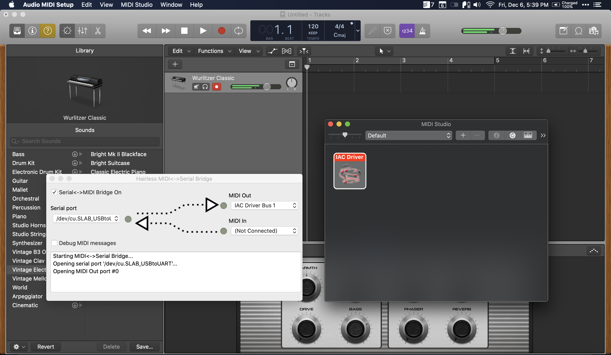

# Musical Instrument

> CPSC 334 - Creative Embedded Systems - Module 7 - Final Project

## Table of Contents

- [Musical Instrument](#musical-instrument)
  - [Table of Contents](#table-of-contents)
  - [Budget](#budget)
  - [Technical Challenges](#technical-challenges)
    - [HC-SR04 readings](#hc-sr04-readings)
    - [Photosensor readings](#photosensor-readings)
    - [MIDI setup](#midi-setup)
    - [ESP32 issues](#esp32-issues)
  - [Enclosure design](#enclosure-design)

## Budget

| Name                  | Units | \$/unit      | Total \$ cost |
| --------------------- | ----- | ------------ | ------------- |
| Wooden dowels         | 2     | Free in CEID | 0             |
| 13 x 11 acrylic piece | 1     | Free in CEID | 0             |
| Laser diodes          | 13    | 0.55         | 7.15          |
| Photoresistors        | 13    | Free in CEID | 0             |
| DAW e.g. Logic        | 1     | Variable     | -             |

Tools required:

- Laser cutter
- Drill
- Hot glue
- Wire cutter
- Soldering iron

## Technical Challenges

### HC-SR04 readings

Having used the sensor in a previous project, the readings can be quite volatile and noisy. For the instrument, much smoother transitions are required. One suggestion was to drive smoother _changes_ to a distance measure rather than updating absolute distance. Another was to take multiple readings, discard outliers and take the average.

Eventually, I found a library called NewPing that does a median computation automatically. Moreover, it can work with a single pin input from the sensor, which works well, since the instrument makes use of many such sensors.

### Photosensor readings

Analog: range from 150- for dark to 500 for ambient to 1500+ for bright, directed light.

### MIDI setup

Many options were tried:

- ESP32 MIDI BLE => MIDI in to Logic on macOS
- ESP32 Serial Out => Python Script on macOS => MIDI in to Logic on macOS
- ESP32 MIDI over Serial Out => Hairless MIDI app on macOS => MIDI in to Logic on macOS

The first option was not reliable as the Bluetooth connection between the ESP32 and macOS kept dropping.

The second and third options are quite similar, but whereas I would have had to write the logic by myself in Python using a library like [Mido](https://mido.readthedocs.io/en/latest/), with Hairless MIDI this is already taken care of.

Hairless MIDI is currently compiled for 32-bit, which posed a problem since I am using macOS Catalina. However, [this GitHub issue](https://github.com/projectgus/hairless-midiserial/issues/51) has an experimental 64-bit version. However, the Preferences must be re-saved in order for the program to work without crashing.

The Hairless MIDI website [describes the required setup](https://projectgus.github.io/hairless-midiserial/), which involves enabling an IAC Driver Bus in the macOS MIDI settings.

### ESP32 issues

- Some pins (e.g. GPIO 13) are used for boot up, and setting them as INPUT interferes with the flashing process. The solution is not to use the pin or leave it unplugged during boot. [Relevant issue on Github](https://github.com/espressif/esp-idf/issues/113).

## Enclosure design

Initially I had wanted to make the instrument a black-box, which would add to the mystery of the workings of the instrument. But after accidentally laser cutting a piece of acrylic instead of wood, I thought it would be interesting to pivot and give the user/viewer insight into the bare metal.

To effectively showcase the inner workings and electronics, I gave lots of thought to the circuit layout, its symmetry and color coding of wiring. The photoresistors, for example, are soldered to common rails to minimize clutter.
